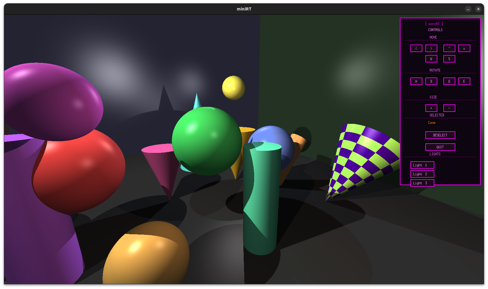
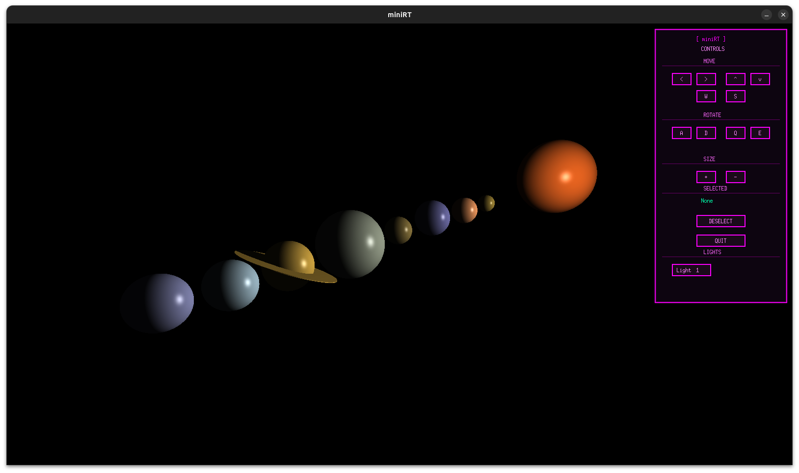

# MiniRT - Ray Tracer

A fully functional ray tracer written in C from scratch as part of the 42 curriculum. **MiniRT** renders 3D scenes with realistic lighting, shadows, and interactive object manipulation.


## ✨ Features

### Core Ray Tracing
- **Custom Vector Math Library** - No external dependencies
- **Ray-Object Intersection** - Spheres, planes, cylinders, and cones
- **Phong Lighting Model** - Ambient, diffuse, and shadow calculations
- **Multi-threaded Rendering** - 8 threads for smooth performance
- **FOV-based Camera System** - Proper viewport calculation with arbitrary orientations

### Interactive Scene Editing
- **Object Selection** - Click objects to select and manipulate
- **Transform Objects** - Move, rotate, and resize selected objects in real-time
- **Scene Export** - Print current scene configuration to `.rt` format



## 🎮 Controls

### Camera
- **Arrow Keys / WASD** - Move camera position
- **A / D** - Rotate camera left/right
- **Q / E** - Rotate camera up/down
- **Mouse** - Click to select objects

### Object Manipulation (when object selected)
- **Arrow Keys / WASD** - Move object
- **+ / -** - Resize object
- **R** - Deselect object

### General
- **ESC** - Quit program

## 🛠️ Technical Implementation

### Ray Tracing Pipeline
1. **Ray Generation** - Calculate ray direction from camera FOV and pixel coordinates
2. **Intersection Testing** - Test ray against all scene objects using quadratic equations
3. **Closest Hit** - Find nearest intersection point
4. **Lighting Calculation** - Apply Phong model (ambient + diffuse)
5. **Shadow Rays** - Cast rays to light sources to determine shadows

### Mathematics
- **Orthonormal Basis Calculation** - Proper camera orientation using cross products
- **Quadratic Solver** - Ray-sphere, ray-cylinder, ray-cone intersections
- **Vector Operations** - Dot product, cross product, normalization
- **Color Clamping** - RGB values properly bounded to [0-255]

### Optimization Techniques
- **Preview Rendering** - Skip lighting calculations during interaction
- **Block Rendering** - Render NxN pixel blocks for faster feedback
- **Thread Pool** - Divide frame into strips for parallel rendering
- **Key Repeat** - Continuous movement when holding keys



## 🧩 Supported Objects

| Object | Intersection | Features |
|--------|-------------|----------|
| **Sphere** | Quadratic equation | Full transformation support |
| **Plane** | Dot product | Infinite extent |
| **Cylinder** | Quadratic + caps | Finite height with circular caps |
| **Cone** | Quadratic + cap | Pointed tip with circular base |

## 🛠️ Technologies

* **C** - Strict Norminette compliance
* **MiniLibX** - X11-based graphics library
* **pthreads** - Multi-threaded rendering
* **Custom Math** - No external libraries (no libm for vectors)


## 📦 Installation

```bash
# Clone the repository
git clone <repository_url> raytracing_v1
cd raytracing_v1

# Compile (includes MiniLibX)
make

# Run with a scene file
./miniRT map/test_complete.rt
./miniRT map/planets.rt
```

## 📁 Scene File Format

MiniRT uses `.rt` files to describe scenes. Here's the format:

```
A 0.2 255,255,255                          # Ambient lighting (ratio, RGB)
C 0,1,-10 0,0,1 70                         # Camera (position, direction, FOV)
L 4,1,-5 0.8 255,255,255                   # Light (position, brightness, RGB)

sp 0,0,5 2.0 255,0,0                       # Sphere (position, diameter, RGB)
pl 0,-1,0 0,1,0 200,200,200                # Plane (position, normal, RGB)
cy 2,0,3 0,1,0 1.0 4.0 0,255,0             # Cylinder (pos, axis, diam, height, RGB)
co -2,0,3 0,1,0 1.0 3.0 0,0,255            # Cone (pos, axis, diam, height, RGB)
```

### Format Rules
- **A** (Ambient): `A <ratio:0.0-1.0> <R,G,B:0-255>`
- **C** (Camera): `C <x,y,z> <nx,ny,nz:normalized> <FOV:0-180>`
- **L** (Light): `L <x,y,z> <brightness:0.0-1.0> <R,G,B>`
- **sp** (Sphere): `sp <x,y,z> <diameter> <R,G,B>`
- **pl** (Plane): `pl <x,y,z> <nx,ny,nz:normalized> <R,G,B>`
- **cy** (Cylinder): `cy <x,y,z> <nx,ny,nz:normalized> <diameter> <height> <R,G,B>`
- **co** (Cone): `co <x,y,z> <nx,ny,nz:normalized> <diameter> <height> <R,G,B>`


## 📂 Project Structure

```
raytracing_v1/
├── src/
│   ├── main.c                    # Entry point and initialization
│   ├── intersect/                # Ray-object intersection tests
│   │   ├── sphere.c              # Ray-sphere intersection
│   │   ├── plane.c               # Ray-plane intersection
│   │   ├── cylinder.c            # Ray-cylinder intersection
│   │   ├── cone.c                # Ray-cone intersection
│   │   ├── trace.c               # Main ray tracing loop
│   │   └── check_*.c             # Object selection helpers
│   ├── render/                   # Rendering pipeline
│   │   ├── camera.c              # Camera ray generation
│   │   ├── render.c              # Full quality rendering
│   │   ├── render_fast.c        # Medium quality mode
│   │   └── render_thread.c      # Multi-threaded rendering
│   ├── light/                    # Lighting calculations
│   │   ├── lighting.c            # Phong lighting model
│   │   ├── shadow.c              # Shadow ray casting
│   │   └── color.c               # Color manipulation
│   ├── math/                     # Vector mathematics
│   │   ├── vector_ops.c          # Basic vector operations
│   │   └── vector_utils.c        # Additional utilities
│   ├── transform/                # Object transformations
│   │   ├── transform_*.c         # Per-object transform functions
│   │   └── selection.c           # Object selection system
│   ├── parser/                   # Scene file parsing
│   │   ├── parser.c              # Main parser
│   │   └── parse_*.c             # Per-element parsers
│   ├── mlx/                      # MiniLibX integration
│   │   ├── init_mlx.c            # Window initialization
│   │   ├── hooks_keys.c          # Keyboard handlers
│   │   ├── hooks_mouse.c         # Mouse handlers
│   │   ├── hud*.c                # On-screen UI
│   │   └── cleanup.c             # Memory cleanup
│   └── utils/                    # Utilities
│       └── *.c                   # String/list utilities
├── inc/
│   ├── minirt.h                  # Main header
│   ├── structs.h                 # Data structures
│   ├── ray.h                     # Ray tracing declarations
│   ├── render.h                  # Rendering functions
│   ├── vector_math.h             # Math functions
│   └── parser.h                  # Parser declarations
├── map/                          # Scene files
├── images/                       # Screenshots
└── Makefile
```

## 🚀 Implementation Highlights

### Vector Math (Custom Implementation)
```c
t_vector vec_add(t_vector a, t_vector b);
t_vector vec_sub(t_vector a, t_vector b);
t_vector vec_scale(t_vector v, double scalar);
double   vec_dot(t_vector a, t_vector b);
t_vector vec_cross(t_vector a, t_vector b);
t_vector vec_normalize(t_vector v);
```

### Ray-Sphere Intersection
```c
// Solve: ||ray.origin + t*ray.dir - sphere.center||² = radius²
// Expands to quadratic: at² + bt + c = 0
double a = vec_dot(ray.dir, ray.dir);
double b = 2.0 * vec_dot(oc, ray.dir);
double c = vec_dot(oc, oc) - radius * radius;
double discriminant = b*b - 4*a*c;
```

### Camera Ray Generation
```c
// Calculate orthonormal basis from camera direction
t_vector right = vec_normalize(vec_cross(cam.dir, world_up));
t_vector up = vec_cross(right, cam.dir);

// Calculate viewport dimensions from FOV
double viewport_height = 2.0 * tan(fov * 0.5 * M_PI / 180.0);
double viewport_width = viewport_height * aspect_ratio;

// Generate ray for pixel (x, y)
t_vector horizontal = vec_scale(right, viewport_width);
t_vector vertical = vec_scale(up, viewport_height);
```

## ⚡ Performance

- **Full Quality**: ~100ms per frame (1600×900, 8 threads)

Smooth interactive editing achieved through automatic mode switching based on user actions.

### Git Workflow
- Feature branches for major components (`feat/ray-sphere-intersection`)


## 🔧 Development Commands

```bash
# Recompile everything
make re

# Clean object files
make clean

# Remove all generated files
make fclean

# Run with different scenes
./miniRT map/test_complete.rt
./miniRT map/planets.rt
./miniRT map/one.rt
```

## 🎓 Learning Outcomes

This project taught:
- **Computer Graphics Fundamentals** - Ray tracing, lighting models, coordinate systems
- **Linear Algebra** - Vector operations, dot/cross products, matrix transformations
- **Performance Optimization** - Multi-threading, preview modes, efficient rendering
- **Software Architecture** - Modular design, separation of concerns
- **C Programming** - Memory management, pointer manipulation, struct design
- **Interactive Systems** - Event handling, real-time feedback, user interaction

## 📚 Resources

- [Ray Tracing in One Weekend](https://raytracing.github.io/) - Excellent introduction to ray tracing
- [Scratchapixel](https://www.scratchapixel.com/) - In-depth computer graphics tutorials
- [MiniLibX Documentation](https://harm-smits.github.io/42docs/libs/minilibx) - MLX API reference
- [Phong Reflection Model](https://en.wikipedia.org/wiki/Phong_reflection_model) - Lighting calculations

## 👨‍💻 Authors

**[El Houssain Souhail]** - [@Ductive99](https://github.com/Ductive99)

**[Anisse Bendrihem]** - [@AnisseBendrihem](https://github.com/AnisseBendrihem)
---

**42 School Project** | MiniRT | 2025
